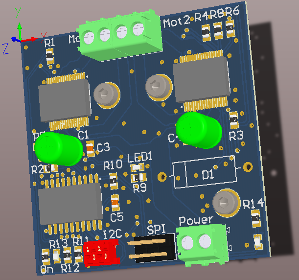

# Enhanced HBridge

## Introduction

This is a double HBridge based on the MC3388X family chip. It can be used to drive two DC motors up to 40V and 5A (an heatsink may be required). Current feedback can be read, therefore enabling torque control. The logic is managed by an ATtiny 2313 which can be controlled through I2C

### Characteristics

The board is still in development.

## Assembly

The board is still in development. For the moment refer to the altium schematics

## Programming

The firmware is still in development. The code has to be put once on the ATtiny 2313 through the SPI interface

## Licence

This board is published under [Creative Commons Attribution Share-Alike license](http://creativecommons.org/licenses/by-sa/3.0/).

